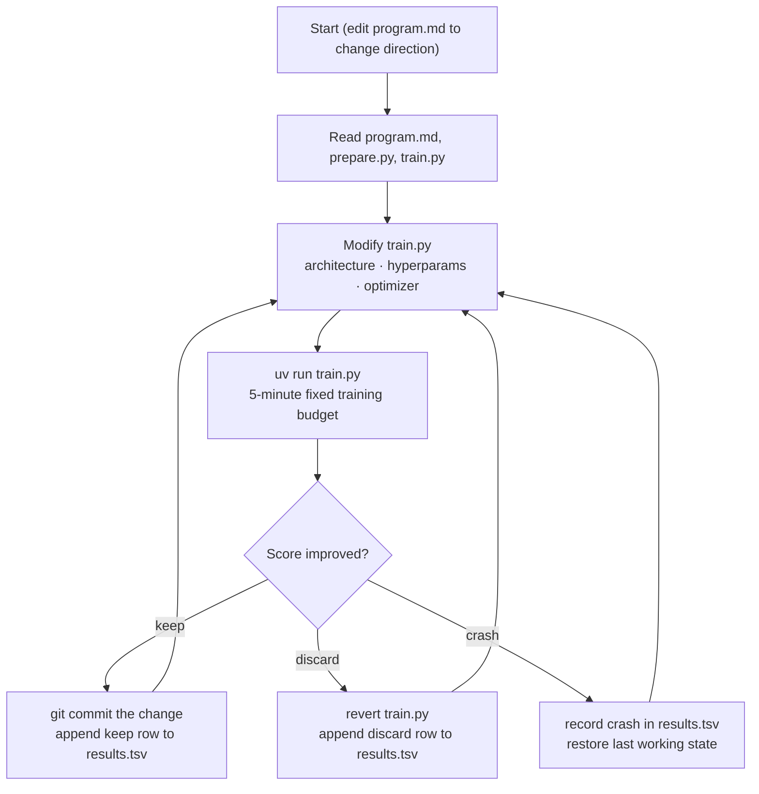

# autoresearch-starter

Train your own small language model tonight — on the gaming PC you already own — and let an AI agent (or you) be the researcher. The loop is simple: change one thing in the training code, train for exactly 5 minutes, check the score, keep or revert, repeat. Run it by hand and you're doing real empirical ML research. Point a coding agent at `program.md` and it runs the same loop unattended for hours while you sleep. Either way, you end up with a model you trained, a scoreboard of every experiment, and a git history that *is* your lab notebook.

**See it first — nothing to install.** The thing you are about to build is already running here: **[autoresearch-demo.fly.dev](https://autoresearch-demo.fly.dev/)**. It serves two models from one real research session — the starting baseline and the best configuration that session found — side by side, so you can hand both the same prompt and read the difference. It is the same browser UI (`chat.py`) this kit ships with, alongside that session's 16-experiment progress chart and a browser for the tokenizer's vocabulary. Free, public, no login. Note what these are: text-completion models, not chat assistants — type the start of a story and they continue it. And one honest caveat: the demo lives on a small machine that sleeps when nobody is visiting, so the *first* page load waits about 12 seconds while it wakes (you get the page, not an error); after that pages come back in a fraction of a second.

**This is a template repository.** On GitHub, click the green **"Use this template"** button → **"Create a new repository"** to get your own copy under your account. Do **not** fork it and do not clone this repo directly — your experiment history is going to live in git commits, and those belong in *your* repo, not this one.

> Based on [karpathy/autoresearch](https://github.com/karpathy/autoresearch), via the Windows/consumer-GPU port [jsegov/autoresearch-win-rtx](https://github.com/jsegov/autoresearch-win-rtx). No NVIDIA GPU? No Windows? See [HARDWARE.md](HARDWARE.md) — there is a path for every machine, including none.

## What you get

- **`train.py`** — the model, optimizer, and training loop. **The one file experiments edit.** Everything in it is fair game: architecture, hyperparameters, batch sizes.
- **`prepare.py`** — data download, tokenizer, dataloader, evaluation, and the fixed rules (5-minute time budget, eval method). **Off-limits during experiments** — it's the referee, and you don't let experiments edit the referee.
- **`program.md`** — the research program: the instructions an agent reads and executes. Works out of the box; rewriting it is the endgame (see [Swap out parts](#swap-out-parts--make-it-yours)).
- **`results.tsv`** — your scoreboard. Starts empty; gains one row per experiment: score, VRAM, keep/discard, description.
- **`chat.py`** — a local browser UI to chat with your trained models and compare checkpoints side by side.
- **`analysis.ipynb`** — a notebook that charts `results.tsv`: score over time, keeps vs discards, top improvements.
- **`cloud/`** — the no-GPU path: a Colab notebook that runs the same loop on a free cloud GPU.

## Quickstart (Windows + NVIDIA)

**Requirements:**

- An NVIDIA GPU meeting the VRAM floor: **Turing (RTX 20-series) with 8 GB+**, or **Ampere / Ada / Blackwell (RTX 30/40/50-series) with 10 GB+**. Laptop GPUs count if they meet the floor.
- [git](https://git-scm.com/download/win)
- [uv](https://docs.astral.sh/uv/) — install with:
  `powershell -ExecutionPolicy ByPass -c "irm https://astral.sh/uv/install.ps1 | iex"`
- Python 3.10+ (uv will fetch one automatically — but read the [Smart App Control note](#troubleshooting-the-real-failure-modes) if it fails to start)

Clone **your** copy (created via "Use this template"), open PowerShell in the repo folder, and run:

```powershell
# 1. Install dependencies (one-time; downloads CUDA-enabled PyTorch)
uv sync

# 2. Download the dataset and train the tokenizer (one-time)
uv run prepare.py

# 3. Fast end-to-end sanity check (~1 min)
uv run train.py --smoke-test

# 4. Your first real experiment (~5 min of training)
uv run train.py
```

A successful run ends with a summary block whose first line is your score:

```
---
val_bpb:          0.818245
```

`val_bpb` is "validation bits per byte" — how surprised the model is by text it has never seen. **Lower is better.** An untrained model scores ~3.2 (that's what the smoke test prints, since it barely trains); after 5 minutes you should be well under 1; improvements of 0.01–0.05 between runs are meaningful.

**Meet your model:**

```powershell
uv run chat.py
```

Open `http://localhost:8000` and type a prompt. The default dataset is [TinyStories](https://huggingface.co/datasets/karpathy/tinystories-gpt4-clean) (GPT-4-written children's stories), so your model will continue any prompt in bedtime-story style. It will be charmingly clumsy at first. Making it less clumsy is the whole game.

## Run the research loop

The loop is the same whether a human or an agent runs it:



### Human mode — be the researcher yourself

You don't need an agent. `program.md` is a complete protocol; follow it by hand:

1. Run `uv run train.py` unchanged once to establish your **baseline** score. Log it in `results.tsv`.
2. Change **one thing** in `train.py` — a constant like `DEPTH`, a learning rate, `WINDOW_PATTERN`. One change per experiment, so you know what caused what.
3. Run `uv run train.py`. Compare `val_bpb` to your current best.
4. **Improved?** `git commit` the change and log a `keep` row. **Worse?** Revert (`git checkout -- train.py`) and log a `discard` row. Log crashes too — a crash you recorded is data; a crash you forgot is a repeat.
5. Go to 2.

Ten runs is an evening and enough to genuinely learn how these knobs behave. Do this before agent mode at least once — you will supervise the agent much better once you've felt the loop yourself.

### Agent mode — direct the researcher

Any coding agent that can read files, edit code, and run terminal commands works. The starting prompt is always:

```
Read program.md, do setup checks, and start a new experiment loop. Log each result in results.tsv.
```

**A word about permissions, before you paste any command below.** For an unattended session the agent needs the ability to edit files and run shell commands *without asking you each time* — that's what "autonomous" means. Flags like `--dangerously-skip-permissions` and `danger-full-access` grant exactly that: the agent can run anything your user account can run, for the whole session. That is the tool doing its job, not a bug — but understand it before granting it. Run agents only in this repo's folder, on a machine whose contents you're comfortable with, and skim the log afterwards. If that trade is not one you want to make yet, use the interactive/selective modes and approve actions by hand.

**Claude Code** (Anthropic's CLI agent):

```powershell
# Install (one-time)
npm install -g @anthropic-ai/claude-code

# Interactive — watch it work, approve each action; Ctrl+C to stop
claude "Read program.md, do setup checks, and start a new experiment loop. Log each result in results.tsv."

# Unattended / overnight — no prompts, everything logged to agent.log
claude --dangerously-skip-permissions "Read program.md, do setup checks, and start a new experiment loop. Log each result in results.tsv." 2>&1 | Tee-Object -FilePath agent.log

# Middle ground — auto-approve file edits, still ask before shell commands
claude --permission-mode acceptEdits "Read program.md, do setup checks, and start a new experiment loop. Log each result in results.tsv."
```

**Codex CLI** (OpenAI's terminal agent):

```powershell
# Install (one-time)
npm install -g @openai/codex

# Unattended — full access, logged to agent.log
codex exec -s danger-full-access "Read program.md, do setup checks, and start a new experiment loop. Log each result in results.tsv." 2>&1 | Tee-Object -FilePath agent.log

# More cautious: -s workspace-write auto-approves edits but asks before shell commands
```

**To stop either:** press **Ctrl+C**. The agent commits after every experiment, so interrupting is always safe — `results.tsv` and git stay consistent. Expect roughly **7–10 experiments per hour** depending on your GPU (eval overhead varies); an overnight 8-hour session is ~55–80 experiments. Come back, open `results.tsv`, read what your researcher found.

## Troubleshooting the real failure modes

**Smart App Control blocks Python (`DLL load failed ... Application Control policy`).**
Windows Smart App Control blocks uv's standalone Python builds because they are unsigned. Fix: install the signed interpreter from [python.org](https://www.python.org/downloads/) (match the version pinned in `.python-version`), then point the venv at it:
```powershell
uv venv --python "C:\Path\To\python.exe"
uv sync
```

**`CUDA not available` (or torch reports no GPU).**
Fix, in order: (1) update your NVIDIA driver and confirm `nvidia-smi` shows your GPU; (2) make sure PyTorch came from `uv sync` — this repo pins CUDA wheels via its own PyTorch index in `pyproject.toml`. If you ever `pip install torch` manually you'll get the CPU-only build; delete `.venv` and re-run `uv sync`.

**VRAM floor warning at startup.**
The script checks the floor (Turing 8 GB+, Ampere/Ada/Blackwell 10 GB+). Below floor, runs will likely crash with out-of-memory errors mid-training. The built-in autotuner already picks the largest batch size that fits — there's little headroom to recover by hand. Below-floor GPU? Use the cloud path in [HARDWARE.md](HARDWARE.md).

**"My scores are worse than the walkthrough's."**
Not a bug. Training runs for a fixed **5 minutes of wall-clock time**, so a slower GPU simply completes fewer steps and lands at a higher `val_bpb`. Correctness is unaffected, and comparisons *within your own machine's history* — the only comparisons the loop needs — are perfectly fair. Never compare absolute scores across different hardware.

**`results.tsv` looks broken / the analysis chokes on it.**
It is **tab**-separated, not comma-separated — descriptions contain commas, and commas as delimiters silently shred rows. Six columns, one row per run, header row intact, never rewrite past rows (the log is append-only, even for discards and crashes). If an agent mangled it, fix the delimiters before the next session; the agent reads this file at startup to know what's been tried.

## Swap out parts — make it yours

This is the heart of the kit. Everything above is the default configuration; none of it is sacred.

### The seven knobs (karpathy's own list for small computers)

From the upstream author's guidance on tuning autoresearch for machines far smaller than an H100:

1. **Use a low-entropy dataset.** Narrow-scope text (like TinyStories) lets small models produce visibly reasonable samples. *Already the default in this kit — knob 1 is pre-turned for you.*
2. **Decrease `VOCAB_SIZE`** (in `prepare.py`): 8192 → 4096, 2048, 1024 — or go all the way to a byte-level tokenizer (256 tokens). Re-run `uv run prepare.py` after changing it, since the tokenizer must be retrained.
3. **Lower `MAX_SEQ_LEN`** (in `prepare.py`), even down to 256, and compensate with a slightly larger per-device batch size (this kit autotunes that per GPU — see the candidate lists in `train.py`).
4. **Decrease `EVAL_TOKENS`** (in `prepare.py`) so validation runs on less data and eats less of your run.
5. **`DEPTH`** (in `train.py`) is the single primary knob for model complexity — most other sizes derive from it. Try lowering it to 4.
6. **`WINDOW_PATTERN`** (in `train.py`): plain `"L"` (full attention everywhere) may beat the banded patterns like `"SSSL"` on small GPUs. Try it.
7. **Lower `TOTAL_BATCH_SIZE`** (in `train.py`) — a lot, but keep it a power of 2, e.g. down to `2**14`.

Knobs 2–4 live in `prepare.py`, which experiments must not touch — but *you*, between sessions, absolutely may. Changing them (or anything in `prepare.py`) resets the meaning of your scores: start a fresh `results.tsv` so the log stays coherent.

### Swap the dataset

Open `prepare.py` and find `DATASET_CONFIGS` near the top. Add an entry: a short name, a URL to a Hugging Face parquet file, and row ranges for the test/val/train splits. Also add the same short name to the `DATASET_CHOICES` tuple just above it — `--dataset` validates against that list and will reject your name otherwise. Then:

```powershell
uv run prepare.py --dataset your-name        # download + retrain tokenizer
uv run train.py  --dataset your-name         # or set AUTORESEARCH_DATASET=your-name
```

Poetry, code, song lyrics, your own writing — anything with enough text works. Scores across datasets are not comparable; fresh `results.tsv`.

### The headline swap: rewrite `program.md`

Here is the real secret of this project: **`program.md` IS the program.** The Python files are the lab equipment; the Markdown file is the research strategy — and it's the layer you're actually meant to iterate on. The default is a deliberately bare-bones greedy hill-climb: try a change, keep if better. You can rewrite the strategy itself:

- **Different metrics to log** — track `mfu_percent`, tokens/sec, or params alongside `val_bpb`; tell the agent to prefer improvements that don't inflate VRAM.
- **Different search policies** — "run every experiment twice and keep only if both improve" (noise control); "sweep one variable across 4 values before deciding" (mini grid search); "alternate one safe tweak with one wild idea" (explore/exploit).
- **Stopping criteria** — "stop after 10 consecutive discards and write a summary of what you believe and why."
- **Scope and risk** — "optimizer changes only tonight"; "no change may increase VRAM above 9 GB"; "prefer deletions."

Two students with identical hardware and different `program.md` files are running different research organizations. Comparing whose *strategy* finds better models faster is a far more interesting competition than comparing GPUs.

## How hosting works (and why not Ollama)

Your trained model ships with its own server — `chat.py` — instead of loading into Ollama or LM Studio. That's not a limitation to apologize for; it's the point. Those apps run **standardized** open-weights architectures packaged as GGUF files: someone else trained the model, llama.cpp knows its exact shape, you just download and run it. Your model is a **deliberately custom architecture** — value embeddings, windowed attention, a custom `rustbpe` tokenizer — that no standard runtime has ever heard of, because you (or your agent) invented this exact configuration last night. Custom architecture ⇒ custom server. Ollama runs other people's models; this kit trains *yours*.

**This isn't theoretical — it's the demo linked at the top.** [autoresearch-demo.fly.dev](https://autoresearch-demo.fly.dev/) is exactly this `chat.py`, in a container, on one small **CPU-only** machine. No GPU is involved in serving, and none is needed: these models are ~19M parameters, so an ordinary shared CPU streams them comfortably. That's the second half of the lesson — a model you can train in five minutes is a model you can host for pocket change. The recipe is public as well. The worked-example repo's [`deploy/`](https://github.com/aroughidea/autoresearch-win-rtx/tree/master/deploy) folder holds the Dockerfile and `fly.toml` behind that site: it builds the image from the repo root and serves the checkpoints committed alongside it, so putting *your* trained model on the internet the same way is mostly a matter of pointing the same recipe at your repo. (The public copy caps generation — max 500 tokens, `top_k` ≤ 200, prompts up to 2000 characters — and shows a banner linking to how those models were made. Everything else is identical to `uv run chat.py` on your own machine.)

**Going-further project (advanced, satisfying):** rewrite `train.py`'s architecture into a llama.cpp-supported one (e.g. a standard Llama-style transformer), train it, convert the checkpoint to GGUF, and genuinely serve your own model in Ollama. Then you'll have earned the standard.

## Going further

- **Worked example** — [aroughidea/autoresearch-win-rtx](https://github.com/aroughidea/autoresearch-win-rtx) is the live repo this template was extracted from: real `results.tsv` history, kept and discarded experiments, and a full session walkthrough in `WALKTHROUGH.md`.
- **Karpathy's own session** — branch [`exp/H100/mar8`](https://github.com/karpathy/autoresearch/tree/exp/H100/mar8) on karpathy/autoresearch: ~125 experiments run overnight on an H100. Read the log like a paper: what did the agent try, what stuck? His project announcement is [here](https://x.com/karpathy/status/2029701092347630069).
- **New to neural networks?** — karpathy's README points beginners at this ["Dummy's Guide"](https://x.com/hooeem/status/2030720614752039185) for the background this README assumes.
- **Different hardware?** — [HARDWARE.md](HARDWARE.md): macOS forks, the free Colab path, and renting a GPU pod for ~$5/night.

### Credits

- [Andrej Karpathy](https://github.com/karpathy) — the original [autoresearch](https://github.com/karpathy/autoresearch) and [nanochat](https://github.com/karpathy/nanochat), which the training code simplifies.
- [jsegov](https://github.com/jsegov) — the [Windows/consumer-GPU port](https://github.com/jsegov/autoresearch-win-rtx) with tiered VRAM floors.
- [aroughidea](https://github.com/aroughidea) — `chat.py`, the cloud path, and this starter packaging.

License: MIT — see [LICENSE](LICENSE).
