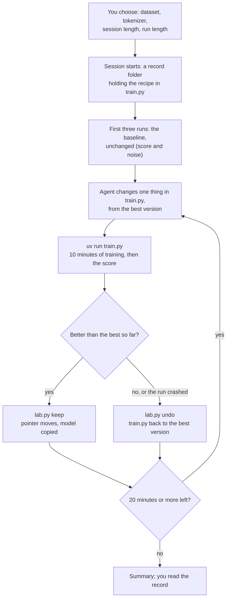

# autoresearch-starter

Train your own small language model tonight — on the gaming PC you already own, or a rented GPU — and let an AI agent be the researcher. You choose the dataset and the tokenizer; the agent changes the training code, trains for exactly 10 minutes, checks the score, keeps or undoes the change, and repeats, unattended, while you sleep. In the morning you have models you trained, sample stories showing what each one wrote as it learned, and the session's record: every version of the recipe it tried, every run and its score, and which version is best. The point is to see how design decisions — the data, the tokens, the recipe the agent evolves — change what a model writes.

**See it first — nothing to install.** The thing you are about to build is already running here: **[autoresearch-demo.fly.dev](https://autoresearch-demo.fly.dev/)**. It serves two models from one real research session — the starting baseline and the best configuration that session found — side by side, so you can hand both the same prompt and read the difference. It is the same browser UI (`chat.py`) this kit ships with, alongside that session's 16-experiment progress chart and a browser for the tokenizer's vocabulary. Free, public, no login. Note what these are: text-completion models, not chat assistants — type the start of a story and they continue it. And notice that the two read almost alike: that session's whole gain was smaller than the difference between two runs of the same code, which is why the agent judges by a score. And one honest caveat: the demo lives on a small machine that sleeps when nobody is visiting, so the *first* page load waits about 12 seconds while it wakes (you get the page, not an error); after that pages come back in a fraction of a second.

**This is a template repository.** On GitHub, click the green **"Use this template"** button → **"Create a new repository"** to get your own copy under your account. Do **not** fork it and do not clone this repo directly: your copy is yours to change, and it should not carry this repo's history or point back at it. Your sessions' records stay on your machine, in `sessions/`.

> Based on [karpathy/autoresearch](https://github.com/karpathy/autoresearch), via the Windows/consumer-GPU port [jsegov/autoresearch-win-rtx](https://github.com/jsegov/autoresearch-win-rtx). No NVIDIA GPU? No Windows? See [HARDWARE.md](HARDWARE.md): your own NVIDIA GPU, a Mac (through a sibling fork), or a GPU rented by the hour.

## What you get

- **`train.py`** — the model, optimizer, and training loop: the training recipe. **The one file experiments edit.** Everything in it is fair game: architecture, hyperparameters, batch sizes.
- **`prepare.py`** — data download, tokenizer, dataloader, evaluation, and the fixed rules (10-minute time budget, eval method). **Off-limits during experiments** — it's the referee, and you don't let experiments edit the referee.
- **`program.md`** — the agent's instructions. Works out of the box, and stays fixed for a whole session.
- **`record.py`** and **`lab.py`** — the experiment record. Each session keeps its own folder, `sessions/<name>/`: every version of `train.py` that trained, one entry per run (its score, keep, discard or crash, what was tried, and its sample stories), a pointer to the best version, and the scoreboard, `results.tsv`. `uv run lab.py history` reads it. Experiments never use git.
- **`capture.py`** — saves what your model writes at 0, 10, 30, 60 and 120 seconds, at 5 minutes, and at the end: the sample stories in each run's entry. Open one to watch a model go from noise to stories. **Off-limits during experiments**, like `prepare.py`.
- **`session.py`** — runs a whole session unattended with Claude Code: starts the record, launches the agent, and restarts it if it stops early.
- **`chat.py`** — a local browser page that runs two of your trained models side by side on the same prompt, with the score chart.
- **`analysis.ipynb`** — a notebook that charts a session's `results.tsv`: score over time, keeps vs discards, top improvements.

## Quickstart (Windows + NVIDIA)

**Requirements:**

- An NVIDIA GPU meeting the VRAM floor: **Turing (RTX 20-series) with 8 GB+**, or **Ampere / Ada / Blackwell (RTX 30/40/50-series) with 10 GB+**. Laptop GPUs count if they meet the floor.
- [git](https://git-scm.com/download/win)
- [uv](https://docs.astral.sh/uv/) — install with:
  `powershell -ExecutionPolicy ByPass -c "irm https://astral.sh/uv/install.ps1 | iex"`
- Python 3.10+ (uv will fetch one automatically — but read the [Smart App Control note](#troubleshooting-the-real-failure-modes) if it fails to start)

Clone **your** copy (created via "Use this template"), open PowerShell in the repo folder, and run:

```powershell
# 1. Install dependencies (one-time; downloads CUDA-enabled PyTorch)
uv sync

# 2. Download the dataset and train the tokenizer (one-time)
uv run prepare.py

# 3. Fast end-to-end sanity check (~1 min)
uv run train.py --smoke-test

# 4. Your first real experiment (~13 min: 10 of training, then scoring)
uv run train.py
```

This first run is a test outside any session, so its run file goes to `runs/`. Sessions keep their runs in their own folders.

A successful run ends with a summary block whose first line is your score:

```
---
val_bpb:          0.520082
```

`val_bpb` is "validation bits per byte" — how surprised the model is by text it has never seen. **Lower is better.** An untrained model scores ~3.2 (that's what the smoke test prints, since it barely trains); after 10 minutes on a laptop RTX 4000 Ada it scored 0.477. Two runs of the same code rarely score exactly the same: on that laptop, 5-minute runs differed by about 0.003. Each session measures its own noise (see below).

**Meet your model:**

```powershell
uv run chat.py
```

Open `http://localhost:8000` and type a prompt. The default dataset is [TinyStories](https://huggingface.co/datasets/karpathy/tinystories-gpt4-clean) (GPT-4-written children's stories), so your model will continue any prompt in bedtime-story style. It will be charmingly clumsy. What makes it less clumsy — the data, the tokens, the recipe — is what this kit lets you explore.

## Run the research loop

An AI agent runs this loop for you for one session: 10 hours by default, with every run training for 10 minutes. The first three runs train your starting recipe unchanged: the baseline. Their average is the first score to beat, and their spread is the session's noise, how far apart two runs of the same recipe land. After that, each run trains a new model from scratch with one change to the recipe; only the recipe carries forward, so the models get better because the recipe does.


```mermaid
flowchart TD
    A["You choose: dataset, tokenizer,\nsession length, run length"] --> B["Session starts: a record folder\nholding the recipe in train.py"]
    B --> C["First three runs: the baseline,\nunchanged (score and noise)"]
    C --> D["Agent changes one thing in train.py,\nfrom the best version"]
    D --> E["uv run train.py\n10 minutes of training, then the score"]
    E --> F{Better than the best so far?}
    F -->|yes| G["lab.py keep\npointer moves, model copied"]
    F -->|"no, or the run crashed"| H["lab.py undo\ntrain.py back to the best version"]
    G --> I{20 minutes or more left?}
    H --> I
    I -->|yes| D
    I -->|no| J["Summary; you read the record"]
```

A run that beats the best is kept, even if the gain is smaller than the noise; the agent says so in that run's description, so you can weigh it in the morning.

### Before you start

- **A coding agent and an account for it.** Claude Code needs a Claude Pro or Max plan or Anthropic API billing; Codex CLI needs a ChatGPT plan or OpenAI API billing. A night of experiments uses a lot of a plan's allowance, and hitting a usage limit ends the run early.
- **Node.js**, which the agents' installers (`npm install -g ...`) need: [nodejs.org](https://nodejs.org/).
- **A PC that stays awake.** Windows Settings → System → Power → set sleep to *Never* while plugged in, for the night.
- **A sign-in that lasts the night, for an unattended run.** A normal Claude Code sign-in can expire partway through a headless session, and every restart then fails until morning. Run `claude setup-token` first and set the token it prints as `CLAUDE_CODE_OAUTH_TOKEN` for the session (or use an API key). Treat either like a password.
- **The recipe you want to start from in `train.py`.** The session stores it as its first version. Out of the box that is the kit's recipe.

**A word about permissions.** For an unattended session the agent needs to edit files and run shell commands *without asking you each time* — that's what "autonomous" means. Flags like `--dangerously-skip-permissions` and `danger-full-access` grant exactly that: the agent can run anything your user account can run, for the whole session. That is the tool doing its job, not a bug — but understand it before granting it. Run agents only in this repo's folder, on a machine whose contents you're comfortable with, and skim the log afterwards.

### Start a session: Claude Code, unattended

```powershell
# Install Claude Code (one-time)
npm install -g @anthropic-ai/claude-code

# Every check, changing nothing (includes one short test reply from the agent)
uv run session.py tinystories own --check

# The session: 10 hours of 10-minute runs on TinyStories with its own tokenizer
uv run session.py tinystories own

# Other choices: dataset, tokenizer, hours, run length
uv run session.py folktales phi3 --hours 6 --run-minutes 5
```

`session.py` prepares the dataset and tokenizer, starts the session's record (`sessions/<dataset>-<tokenizer>-<minutes>min-<date>/`), and launches the agent headless. If the agent's turn ends early it starts it again where it left off: the record holds the state, so nothing is lost. It starts no run in the session's last 20 minutes, ends the agent 25 minutes after the session's end, and stops at once if the sign-in fails. Run the same command again to continue a session that stopped. Its logs go to `session-logs/<name>/`.

### Start a session by hand, with any agent

Any coding agent that can read files, edit code, and run terminal commands works. Start the session's record yourself, then give the agent the starting prompt:

```powershell
uv run prepare.py --dataset tinystories --tokenizer own
uv run lab.py start my-first-session --dataset tinystories --tokenizer own
```

```
Read program.md, do the setup checks, and start a new experiment loop. Record each decision with `uv run lab.py keep` or `uv run lab.py undo`; never edit results.tsv.
```

**Claude Code**, interactive (watch it work; Ctrl+C to stop): `claude "<the prompt>"`. **Codex CLI**, unattended: `codex exec -s danger-full-access "<the prompt>"`. If the agent stops before the session's end, start it again with: *"You were restarted after your last turn ended. Run `uv run lab.py status` and `uv run lab.py history`, finish the bookkeeping for any run that finished, then continue the experiment loop."*

**To stop any session:** press **Ctrl+C**. Stopping is always safe: a run that started and never finished is recorded as a crash at the next decision. Expect about **4 runs an hour** (each takes 13–16 minutes: 10 of training, then scoring), so a 10-hour session is about 40, the first three being the baseline.

### In the morning

1. **`uv run lab.py status`** — the best version, its score, the session's noise. **`uv run lab.py history`** — every run: what the agent tried, the score, keep or discard. **`uv run lab.py check`** — confirms the record is consistent.
2. **`uv run chat.py`**, then `http://localhost:8000` — the score chart, and two of your models side by side on the same prompt. Kept models are in `checkpoints/`. Ask: does the writing differ, and why?
3. **`sessions/<name>/runs/`** — one entry per run, with what the model wrote at each moment of training. Open one and watch it learn.
4. **`uv run lab.py diff`** and **`uv run lab.py show <id>`** — what each version of the recipe changed. To share the night, share the session's folder: it is not in git.

## Troubleshooting the real failure modes

**Smart App Control blocks Python (`DLL load failed ... Application Control policy`).**
Windows Smart App Control blocks uv's standalone Python builds because they are unsigned. Fix: install the signed interpreter from [python.org](https://www.python.org/downloads/) (match the version pinned in `.python-version`), then point the venv at it:
```powershell
uv venv --python "C:\Path\To\python.exe"
uv sync
```

**`CUDA not available` (or torch reports no GPU).**
Fix, in order: (1) update your NVIDIA driver and confirm `nvidia-smi` shows your GPU; (2) make sure PyTorch came from `uv sync` — this repo pins CUDA wheels via its own PyTorch index in `pyproject.toml`. If you ever `pip install torch` manually you'll get the CPU-only build; delete `.venv` and re-run `uv sync`.

**VRAM floor warning at startup.**
The script checks the floor (Turing 8 GB+, Ampere/Ada/Blackwell 10 GB+). Below floor, runs will likely crash with out-of-memory errors mid-training. The built-in autotuner already picks the largest batch size that fits — there's little headroom to recover by hand. Below-floor GPU? Rent one by the hour: see [HARDWARE.md](HARDWARE.md).

**"My scores are worse than the walkthrough's."**
Not a bug. Training runs for a fixed **10 minutes of wall-clock time**, so a slower GPU simply completes fewer steps and lands at a higher `val_bpb`. Correctness is unaffected, and comparisons *within your own machine's history* — the only comparisons the loop needs — are perfectly fair. Never compare absolute scores across different hardware.

**The record looks wrong, or `lab.py` refuses to train.**
Run `uv run lab.py check`: it names anything inconsistent. A session's `results.tsv` is written by `lab.py` from the run entries; never edit it by hand (`uv run lab.py export` rewrites it). If `lab.py` says a fixed file such as `program.md` or `prepare.py` changed since the session started, `uv run lab.py restore` puts back the session's copy. If you want to train outside a session (a quick test, say), end it first with `uv run lab.py end`: its folder stays.

## Swap out parts — make it yours

This is the heart of the kit. Everything above is the default configuration; none of it is sacred.

### Swap the dataset or the tokenizer

Two datasets and three tokenizers are built in. Choosing them is your decision, not the agent's:

```powershell
uv run prepare.py --dataset folktales                       # folk and myth tales instead of TinyStories
uv run prepare.py --dataset tinystories --tokenizer phi3    # Phi-3 / Llama 2 vocabulary (32,011 tokens)
uv run prepare.py --dataset tinystories --tokenizer gpt2    # GPT-2 vocabulary (50,257); needs about 10 GB of GPU memory
uv run prepare.py --dataset tinystories --tokenizer own     # back to the default: a vocabulary built from the data
```

The pair you prepare last is active for training, `generate.py` and `chat.py`, and every run file records it. Scores compare across tokenizers on the same dataset, never across datasets: start a new session when you switch dataset or tokenizer (a session refuses runs from any other pair). Phi-3 scores about 0.1% low: it counts one extra byte per document for its word-boundary marker, so treat differences smaller than that as ties.

To add your own text (poetry, code, your own writing), add an entry to `DATASET_CONFIGS` and its name to `DATASET_CHOICES` in `prepare.py`.

### Rewrite `program.md`, between sessions

`program.md` is the agent's instructions: how experiments are run and judged. It is fixed during a session (the record refuses to train if it changes), and the default works as it is: a deliberately bare-bones greedy hill-climb, try a change and keep it if it beats the best. Most of the time there is no reason to change it; the agent supplies the ideas. Between sessions, though, you can change the strategy itself:

- **Different metrics to log** — track `mfu_percent`, tokens/sec, or params alongside `val_bpb`; tell the agent to prefer improvements that don't inflate VRAM.
- **Different search policies** — "sweep one variable across 4 values before deciding" (mini grid search); "alternate one safe tweak with one wild idea" (explore/exploit).
- **Stopping criteria** — "stop after 10 consecutive discards and write a summary of what you believe and why."
- **Scope and risk** — "optimizer changes only tonight"; "no change may increase VRAM above 9 GB"; "prefer deletions."

Two students with identical hardware and different `program.md` files are running different research strategies, and the records will show it.

## How hosting works (and why not Ollama)

Your trained model ships with its own server — `chat.py` — instead of loading into Ollama or LM Studio. That's not a limitation to apologize for; it's the point. Those apps run **standardized** open-weights architectures packaged as GGUF files: someone else trained the model, llama.cpp knows its exact shape, you just download and run it. Your model is a **deliberately custom architecture** — value embeddings, windowed attention, a custom `rustbpe` tokenizer — that no standard runtime has ever heard of, because you (or your agent) invented this exact configuration last night. Custom architecture ⇒ custom server. Ollama runs other people's models; this kit trains *yours*.

**This isn't theoretical — it's the demo linked at the top.** [autoresearch-demo.fly.dev](https://autoresearch-demo.fly.dev/) is exactly this `chat.py`, in a container, on one small **CPU-only** machine. No GPU is involved in serving, and none is needed: these models are ~19M parameters, so an ordinary shared CPU streams them comfortably. That's the second half of the lesson — a model you can train in ten minutes is a model you can host for pocket change. The recipe is public as well. The worked-example repo's [`deploy/`](https://github.com/aroughidea/autoresearch-win-rtx/tree/master/deploy) folder holds the Dockerfile and `fly.toml` behind that site: it builds the image from the repo root and serves the checkpoints and scoreboard it copies in, so putting *your* trained model on the internet the same way means giving the image your kept model and its session's scoreboard. (The public copy caps generation — max 500 tokens, `top_k` ≤ 200, prompts up to 2000 characters — and shows a banner linking to how those models were made. Everything else is identical to `uv run chat.py` on your own machine.)

**Going-further project (advanced, satisfying):** rewrite `train.py`'s architecture into a llama.cpp-supported one (e.g. a standard Llama-style transformer), train it, convert the checkpoint to GGUF, and genuinely serve your own model in Ollama. Then you'll have earned the standard.

## Going further

### Run the loop by hand (stretch goal)

The agent is the default, but `program.md` is a complete protocol you can follow by hand, which is a good way to see what the agent is deciding:

1. Start a session: `uv run lab.py start by-hand --dataset tinystories --tokenizer own`.
2. Run `uv run train.py` three times without changing anything, then `uv run lab.py keep "baseline, three runs"`. Their average is your **baseline** score; their spread (in `uv run lab.py status`) is your noise.
3. Change **one thing** in `train.py` — a constant like `DEPTH`, a learning rate, `WINDOW_PATTERN`. One change per experiment, so you know what caused what.
4. Run `uv run train.py`. Compare `val_bpb` with the best (`uv run lab.py status`).
5. **Improved?** `uv run lab.py keep "<what you changed>"`: the change becomes the best version and the model is saved in `checkpoints/`. **Worse, or it crashed?** `uv run lab.py undo "<what you changed>"`: `train.py` goes back to the best version, and the record keeps what you tried.
6. Go to 3.

Ten runs is about two and a half hours.

### Hand-tuning: the seven knobs (stretch goal)

From the upstream author's guidance on tuning autoresearch for machines far smaller than an H100:

1. **Use a low-entropy dataset.** Narrow-scope text (like TinyStories) lets small models produce visibly reasonable samples. *Already the default in this kit — knob 1 is pre-turned for you.*
2. **Decrease `VOCAB_SIZE`** (in `prepare.py`; it sizes the `own` tokenizer only): 8192 → 4096, 2048, 1024. Delete that dataset's `tokenizer` folder in the cache and re-run `uv run prepare.py`, since the tokenizer must be retrained. For a standard vocabulary instead, use `--tokenizer`.
3. **Lower `MAX_SEQ_LEN`** (in `prepare.py`), even down to 256, and compensate with a slightly larger per-device batch size (this kit autotunes that per GPU — see the candidate lists in `train.py`).
4. **Decrease `EVAL_TOKENS`** (in `prepare.py`) so validation runs on less data and eats less of your run.
5. **`DEPTH`** (in `train.py`) is the single primary knob for model complexity — most other sizes derive from it. Try lowering it to 4.
6. **`WINDOW_PATTERN`** (in `train.py`): plain `"L"` (full attention everywhere) may beat the banded patterns like `"SSSL"` on small GPUs. Try it.
7. **Lower `TOTAL_BATCH_SIZE`** (in `train.py`) — a lot, but keep it a power of 2, e.g. down to `2**14`.

Knobs 2–4 live in `prepare.py`, which experiments must not touch — but *you*, between sessions, absolutely may. Changing them (or anything in `prepare.py`) resets the meaning of your scores, so start a new session; during a session the record refuses to train with a changed `prepare.py`.

### More to read

- **What this demonstrates** — [TRAINING-DECISIONS.md](https://github.com/aroughidea/autoresearch-win-rtx/blob/master/TRAINING-DECISIONS.md) in the worked example: the learning goals, and what each decision changes, in plain language.
- **Worked example** — [aroughidea/autoresearch-win-rtx](https://github.com/aroughidea/autoresearch-win-rtx) is the live repo this template was extracted from: a real session's scoreboard (from before the record, when experiments were git commits), kept and discarded experiments, and a full session walkthrough in `WALKTHROUGH.md`.
- **Karpathy's own session** — branch [`exp/H100/mar8`](https://github.com/karpathy/autoresearch/tree/exp/H100/mar8) on karpathy/autoresearch: ~125 experiments run overnight on an H100. Read the log like a paper: what did the agent try, what stuck? His project announcement is [here](https://x.com/karpathy/status/2029701092347630069).
- **New to neural networks?** — karpathy's README points beginners at this ["Dummy's Guide"](https://x.com/hooeem/status/2030720614752039185) for the background this README assumes.
- **Different hardware?** — [HARDWARE.md](HARDWARE.md): macOS forks, and renting a GPU pod for ~$5/night.

### Credits

- [Andrej Karpathy](https://github.com/karpathy) — the original [autoresearch](https://github.com/karpathy/autoresearch) and [nanochat](https://github.com/karpathy/nanochat), which the training code simplifies.
- [jsegov](https://github.com/jsegov) — the [Windows/consumer-GPU port](https://github.com/jsegov/autoresearch-win-rtx) with tiered VRAM floors.
- [aroughidea](https://github.com/aroughidea) — the experiment record and `session.py`, `chat.py`, run capture, the dataset and tokenizer choices, and this starter packaging.

License: MIT — see [LICENSE](LICENSE).
